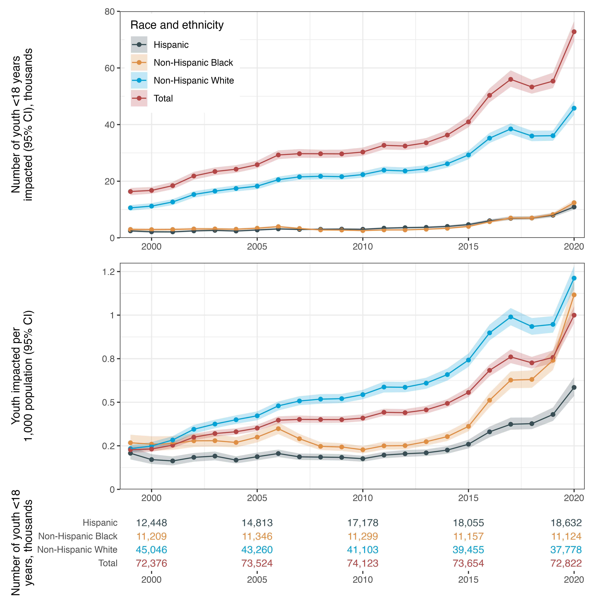

<!-- README.md is generated from README.Rmd. Please edit that file -->

## Youth experiencing parental death due to drug poisoning and firearm violence in the US, 1999 - 2020



This repository,
[`parental_death`](https://github.com/benjisamschlu/parental_death),
contains reproducible code for manuscript, “Youth experiencing parental
death due to drug poisoning and firearm violence in the US, 1999 -
2020”, which uses publicly-available multiple causes of death data from
January 1, 1990, through December 31, 2020, from the [National Center
for Health Statistics](https://wonder.cdc.gov/) to
quantify the number of children experiencing parental death due to drugs
and firearms. The full citation is:

> Schlüter B-S, Alburez-Gutierrez D, Bibbins-Domingo K, Alexander M,
> Kiang MV, “Youth experiencing parental death due to drug poisoning and
> firearm violence in the US, 1999 - 2020.” *JAMA*. Published online May
> 4, 2024. doi:
> [10.1001/jama.2024.8391](https://jamanetwork.com/journals/jama/fullarticle/10.1001/jama.2024.8391?utm_campaign=articlePDF%26utm_medium=articlePDFlink%26utm_source=articlePDF%26utm_content=jama.2024.8391)

## Keypoints

**Question.** What are the estimated rates of US youth (younger than 18
years) who have lost a parent due to drug poisoning or firearms?

**Findings.** In this cross-sectional study of the US population using
publicly available data from 1990 through 2020, between 1999 and 2020,
an estimated 1.19 million US youth had a parent die by drug poisoning or
firearms. In 2020, drugs and firearms caused 23% of all parental deaths
compared with 12% in 1999, and Black youth experienced a
disproportionate burden, mainly due to firearm deaths of fathers.

**Meaning.** Results of this modeling study suggest that US youth are at
high and increasing risk of experiencing parental death by drugs or
firearms.

## About this repository

All code can be found in the `./codes` folder and must be run in order.
The first few lines of each code file contains a brief description of
the tasks related to that file. Numeric representation of our figures
can be found in the `./outputs/data_public` folder. Figures are in the
`./outputs/figures` folder. The table was generated using `Excel` with
data in `./outputs/tables/table_data_manuscript.xlsx` created with code
`./codes/05_numbers_text.R`.

## Authors (alphabetical)

- [Diego Alburez-Gutierrez](https://alburez.me/)
- [Monica Alexander](https://www.monicaalexander.com/)
- [Kirsten
  Bibbins-Domingo](https://profiles.ucsf.edu/kirsten.bibbins-domingo)
- [Mathew V Kiang](https://mathewkiang.com)
- [Benjamin-Samuel Schlüter](https://www.benjaminschluter.com/)

## Notes on Reproducibility

We use publicly available data and provide code that will download
and/or munge these data as necessary. For full reproducibility, we also
provide [all of our simulation
files](https://dataverse.harvard.edu/dataset.xhtml?persistentId=doi:10.7910/DVN/ZJM4ZX),
which will allow for exact reproduction of our results. These files are
stores on [the Harvard
Dataverse](https://dataverse.harvard.edu/dataset.xhtml?persistentId=doi:10.7910/DVN/ZJM4ZX);
however, due to limitations on file size, we split each of the (\>5GB)
simulation files into 10 smaller chunks and provide code to recombine
them (`./codes/00_combine_sim_files.R`). If you wish to fully reproduce
our results, use the `00` code file to download the files noting that
they take up approximately 55GB of space and require ~16GB of RAM (each
file) to recombine.

We use [`renv`](https://rstudio.github.io/renv/index.html) for package
management but below we also post the relevant session information to
ensure full reproducibility.

``` r
> sessioninfo::session_info()
- Session info -------------------------------------------------------
 setting  value
 version  R version 4.1.3 (2022-03-10)
 os       Windows 10 x64 (build 19044)
 system   x86_64, mingw32
 ui       RStudio
 language (EN)
 collate  English_United States.1252
 ctype    English_United States.1252
 tz       Europe/Paris
 date     2023-11-27
 rstudio  2023.09.1+494 Desert Sunflower (desktop)
 pandoc   3.1.1 @ C:/Program Files/RStudio/resources/app/bin/quarto/bin/tools/ (via rmarkdown)

- Packages -----------------------------------------------------------
 ! package     * version date (UTC) lib source
 P askpass       1.2.0   2023-09-03 [?] CRAN (R 4.1.3)
 P cellranger    1.1.0   2016-07-27 [?] CRAN (R 4.1.3)
 P cli           3.6.1   2023-03-23 [?] CRAN (R 4.1.3)
 P colorspace    2.1-0   2023-01-23 [?] CRAN (R 4.1.3)
 P digest        0.6.33  2023-07-07 [?] CRAN (R 4.1.3)
 P dplyr       * 1.1.4   2023-11-17 [?] CRAN (R 4.1.3)
 P evaluate      0.23    2023-11-01 [?] CRAN (R 4.1.3)
 P fansi         1.0.5   2023-10-08 [?] CRAN (R 4.1.3)
 P fastmap       1.1.1   2023-02-24 [?] CRAN (R 4.1.3)
 P forcats     * 1.0.0   2023-01-29 [?] CRAN (R 4.1.3)
 P generics      0.1.3   2022-07-05 [?] CRAN (R 4.1.3)
 P ggplot2     * 3.4.4   2023-10-12 [?] CRAN (R 4.1.3)
 P glue          1.6.2   2022-02-24 [?] CRAN (R 4.1.3)
 P gtable        0.3.4   2023-08-21 [?] CRAN (R 4.1.3)
 P here        * 1.0.1   2020-12-13 [?] CRAN (R 4.1.3)
 P hms           1.1.3   2023-03-21 [?] CRAN (R 4.1.3)
 P htmltools     0.5.7   2023-11-03 [?] CRAN (R 4.1.3)
 P httr          1.4.7   2023-08-15 [?] CRAN (R 4.1.3)
 P knitr         1.45    2023-10-30 [?] CRAN (R 4.1.3)
 P lattice       0.20-45 2021-09-22 [?] CRAN (R 4.1.3)
 P lifecycle     1.0.4   2023-11-07 [?] CRAN (R 4.1.3)
 P lubridate   * 1.9.3   2023-09-27 [?] CRAN (R 4.1.3)
 P magrittr      2.0.3   2022-03-30 [?] CRAN (R 4.1.3)
 P Matrix      * 1.5-4   2023-04-04 [?] CRAN (R 4.1.3)
 P munsell       0.5.0   2018-06-12 [?] CRAN (R 4.1.3)
 P openxlsx    * 4.2.5.2 2023-02-06 [?] CRAN (R 4.1.3)
 P pdftools    * 3.4.0   2023-09-25 [?] CRAN (R 4.1.3)
 P pillar        1.9.0   2023-03-22 [?] CRAN (R 4.1.3)
 P pkgconfig     2.0.3   2019-09-22 [?] CRAN (R 4.1.3)
 P pracma      * 2.4.4   2023-11-10 [?] CRAN (R 4.1.3)
 P purrr       * 1.0.2   2023-08-10 [?] CRAN (R 4.1.3)
 P qpdf          1.3.2   2023-03-17 [?] CRAN (R 4.1.3)
 P R6            2.5.1   2021-08-19 [?] CRAN (R 4.1.3)
 P Rcpp          1.0.11  2023-07-06 [?] CRAN (R 4.1.3)
 P readr       * 2.1.4   2023-02-10 [?] CRAN (R 4.1.3)
 P readxl      * 1.4.3   2023-07-06 [?] CRAN (R 4.1.3)
   renv        * 1.0.3   2023-09-19 [1] CRAN (R 4.1.3)
 P rlang         1.1.2   2023-11-04 [?] CRAN (R 4.1.3)
 P rmarkdown     2.25    2023-09-18 [?] CRAN (R 4.1.3)
 P rprojroot     2.0.4   2023-11-05 [?] CRAN (R 4.1.3)
 P rstudioapi    0.15.0  2023-07-07 [?] CRAN (R 4.1.3)
 P rvest       * 1.0.3   2022-08-19 [?] CRAN (R 4.1.3)
 P scales        1.2.1   2022-08-20 [?] CRAN (R 4.1.3)
 P sessioninfo * 1.2.2   2021-12-06 [?] CRAN (R 4.1.3)
 P stringi       1.8.2   2023-11-23 [?] CRAN (R 4.1.3)
 P stringr     * 1.5.1   2023-11-14 [?] CRAN (R 4.1.3)
 P tibble      * 3.2.1   2023-03-20 [?] CRAN (R 4.1.3)
 P tidyr       * 1.3.0   2023-01-24 [?] CRAN (R 4.1.3)
 P tidyselect    1.2.0   2022-10-10 [?] CRAN (R 4.1.3)
 P tidyverse   * 2.0.0   2023-02-22 [?] CRAN (R 4.1.3)
 P timechange    0.2.0   2023-01-11 [?] CRAN (R 4.1.3)
 P tzdb          0.4.0   2023-05-12 [?] CRAN (R 4.1.3)
 P utf8          1.2.4   2023-10-22 [?] CRAN (R 4.1.3)
 P vctrs         0.6.4   2023-10-12 [?] CRAN (R 4.1.3)
 P withr         2.5.2   2023-10-30 [?] CRAN (R 4.1.3)
 P xfun          0.41    2023-11-01 [?] CRAN (R 4.1.3)
 P xml2          1.3.5   2023-07-06 [?] CRAN (R 4.1.3)
 P yaml          2.3.7   2023-01-23 [?] CRAN (R 4.1.3)
 P zip           2.3.0   2023-04-17 [?] CRAN (R 4.1.3)

 [1] C:/Users/bschluter/Desktop/Postdoc/Projects/parental_death_drugs_firearms/renv/library/R-4.1/x86_64-w64-mingw32
 [2] C:/Users/bschluter/AppData/Local/R/cache/R/renv/sandbox/R-4.1/x86_64-w64-mingw32/5d681d51

 P -- Loaded and on-disk path mismatch.

----------------------------------------------------------------------
```

``` r
> sessionInfo()
R version 4.1.3 (2022-03-10)
Platform: x86_64-w64-mingw32/x64 (64-bit)
Running under: Windows 10 x64 (build 19044)

Matrix products: default

locale:
[1] LC_COLLATE=English_United States.1252 
[2] LC_CTYPE=English_United States.1252   
[3] LC_MONETARY=English_United States.1252
[4] LC_NUMERIC=C                          
[5] LC_TIME=English_United States.1252    

attached base packages:
[1] stats     graphics  grDevices datasets  utils     methods  
[7] base     

other attached packages:
 [1] sessioninfo_1.2.2 renv_1.0.3        Matrix_1.5-4     
 [4] pracma_2.4.4      rvest_1.0.3       pdftools_3.4.0   
 [7] readxl_1.4.3      openxlsx_4.2.5.2  here_1.0.1       
[10] lubridate_1.9.3   forcats_1.0.0     stringr_1.5.1    
[13] dplyr_1.1.4       purrr_1.0.2       readr_2.1.4      
[16] tidyr_1.3.0       tibble_3.2.1      ggplot2_3.4.4    
[19] tidyverse_2.0.0  

loaded via a namespace (and not attached):
 [1] qpdf_1.3.2        tidyselect_1.2.0  xfun_0.41        
 [4] lattice_0.20-45   colorspace_2.1-0  vctrs_0.6.4      
 [7] generics_0.1.3    htmltools_0.5.7   yaml_2.3.7       
[10] utf8_1.2.4        rlang_1.1.2       pillar_1.9.0     
[13] glue_1.6.2        withr_2.5.2       lifecycle_1.0.4  
[16] munsell_0.5.0     gtable_0.3.4      cellranger_1.1.0 
[19] zip_2.3.0         evaluate_0.23     knitr_1.45       
[22] tzdb_0.4.0        fastmap_1.1.1     fansi_1.0.5      
[25] Rcpp_1.0.11       scales_1.2.1      hms_1.1.3        
[28] askpass_1.2.0     digest_0.6.33     stringi_1.8.2    
[31] grid_4.1.3        rprojroot_2.0.4   cli_3.6.1        
[34] tools_4.1.3       magrittr_2.0.3    pkgconfig_2.0.3  
[37] xml2_1.3.5        timechange_0.2.0  rmarkdown_2.25   
[40] httr_1.4.7        rstudioapi_0.15.0 R6_2.5.1         
[43] compiler_4.1.3  
```
